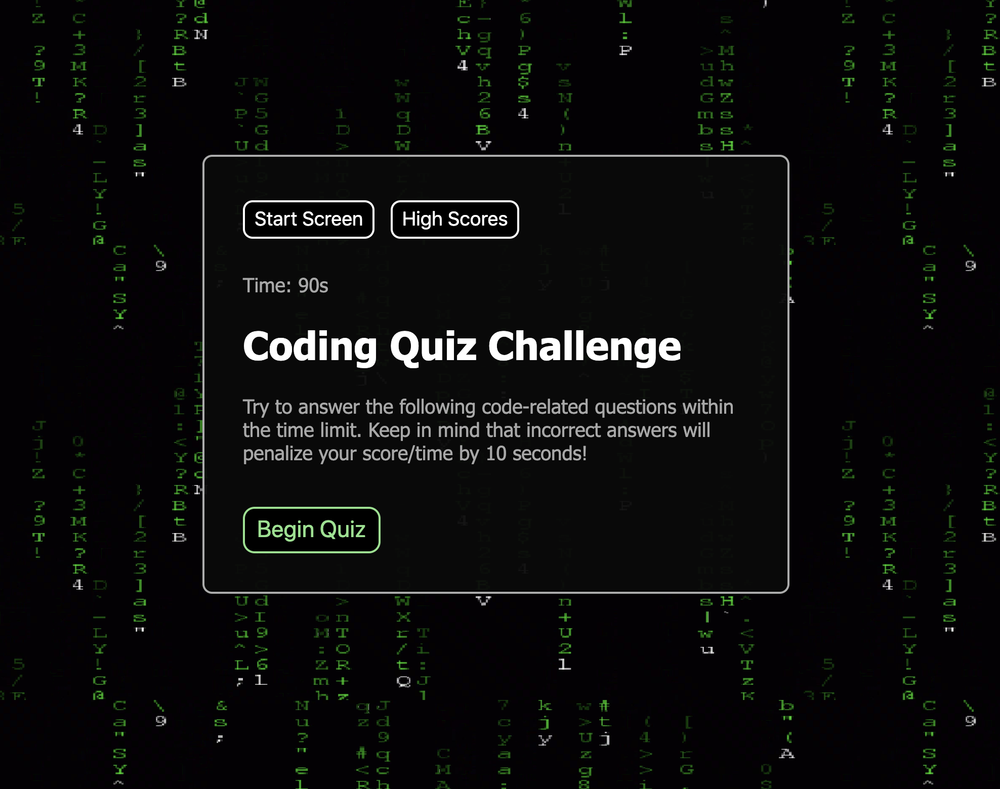

# 04-code-quiz
## Unit 04 Web APIs Homework: Code Quiz

A responsive code quiz built with javascript, featuring DOM manipulation and persistent high scores via the browser's localStorage. 

Live Site: https://onecheesepizza.github.io/04-code-quiz/

